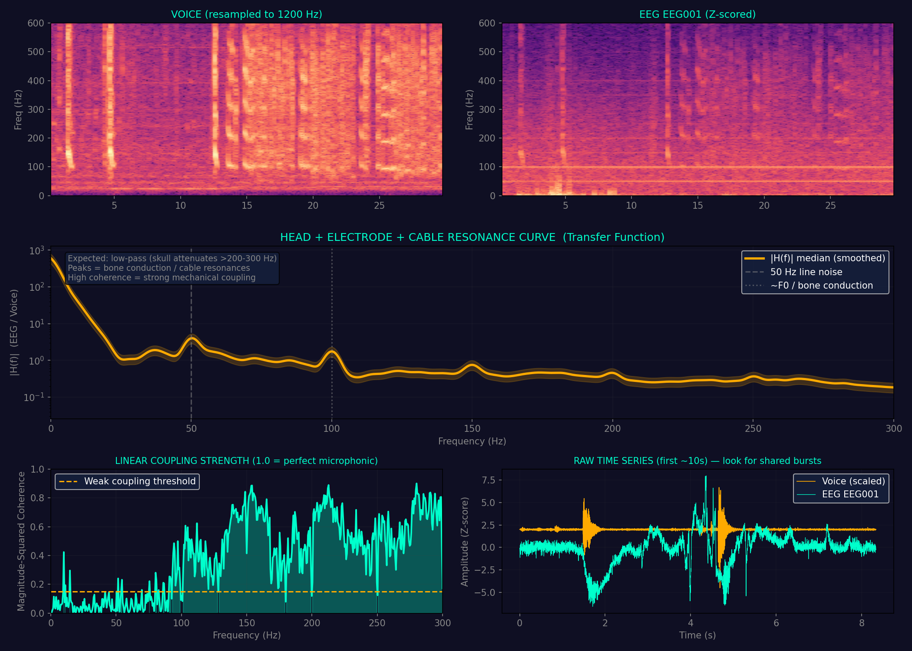

# Head-as-Resonator: Measuring & Inverting Acoustic Coupling in EEG during Overt Speech

Video: https://www.youtube.com/watch?v=P5XqvRTLWxs

**A practical pipeline to quantify mechanical voice pickup in EEG recordings and recover a cleaner "meat voice" signal via inverse filtering.**

This toolkit demonstrates — and helps correct — a well-known but often ignored artifact in speech neuroscience: **acoustic microphonic contamination** of electrophysiological recordings. When a person speaks, sound vibrations travel through the skull, tissue, electrodes, and cables, imprinting a near-perfect copy of the voice onto the EEG. This is **not** neural activity — it is mechanical coupling.

The two scripts let you:
1. **Measure** the exact frequency response `H(f)` of your head + recording setup.
2. **Invert** that response to recover audio that is much closer to the original voice (or, conversely, to subtract the artifact and leave mostly neural residual).

---

## Dataset Used

**EEG-Speech Brain Decoding Dataset** (OpenNeuro ds007630)

- **Task**: `task-speechopen` (overt speaking of open-set sentences/words)
- **Session**: `ses-20240821`
- **Run**: `run-02`
- **Recording**: High-density g.pangolin electrode grid over left temporal lobe (140 channels, 1200 Hz)
- **Participant**: sub-03
- **Simultaneous audio**: `sub-03_ses-20240821_task-speechopen_acq-pangolin_run-02_recording-vocal_beh.wav`

**Citation / Access**:
- Search OpenNeuro for **ds007630**
- Direct link: https://openneuro.org/datasets/ds007630

This is a real, publicly available intracranial/high-density EEG + audio dataset ideal for studying speech production and artifact characterization.

---

## Pipeline Overview

```
EDF (EEG) + WAV (voice) 
        │
        ▼
┌──────────────────────────────┐
│  head_resonator_analyzer.py  │  ← Step 1
│  (computes H(f) transfer     │
│   function + coherence)      │
└──────────────────────────────┘
        │
        ▼  transfer_function.npz  (H_smooth, f, coherence, etc.)
┌──────────────────────────────┐
│       eeg2speech.py          │  ← Step 2
│  (inverse-filters EEG using  │
│   measured H(f) → WAV)       │
└──────────────────────────────┘
        │
        ▼  recovered_meat_voice.wav
```

The recovered WAV is **not** the original clean microphone recording — it is the EEG channel after the skull/cable "muffling" has been inverted. It sounds remarkably voice-like because the coupling is extremely strong.

---

## Installation

Both scripts require the same environment as a typical MNE-Python + audio workflow.

```bash
pip install mne numpy scipy soundfile matplotlib
```

(If you already have the Rajapinta EEG→Audio studio environment, you’re good — it uses the exact same packages.)

Tested with Python 3.11–3.13 on Windows/Linux.

---

## Step-by-Step Usage

### Step 1: Measure the Head Resonance (Analyzer)

```bash
python head_resonator_analyzer.py \
    --edf sub-03_ses-20240821_task-speechopen_acq-pangolin_run-02_eeg.edf \
    --wav sub-03_ses-20240821_task-speechopen_acq-pangolin_run-02_recording-vocal_beh.wav \
    --channel 43 \
    --duration 30 \
    --output-dir output
```

**Key flags**:
- `--channel` — electrode name or index (falls back to highest-variance channel if not found)
- `--duration` — seconds from start of file (30–60 s is usually enough)
- `--lag-ms` — optional manual alignment (the script also auto-estimates mechanical lag via cross-correlation)

**Expected console output** (from actual run):

```
======================================================================
HEAD AS RESONATOR — EEG ↔ VOICE TRANSFER FUNCTION
======================================================================
...
[6/6] SUMMARY
      Peak coherence: 0.954 at 440.6 Hz
      → STRONG mechanical coupling detected (microphonic artifact likely)
      Saved numeric data: output/transfer_function.npz
```

**Outputs created in `--output-dir`**:
- `head_resonance_analysis.png` — 5-panel diagnostic figure (see below)
- `transfer_function.npz` — all numeric results (used by Step 2)



**What the figure tells you**:
- Top row: spectrograms of voice vs EEG — if they look almost identical, you have strong coupling.
- Middle: `|H(f)|` transfer function (how the head+setup filters the voice).
- Bottom-left: magnitude-squared coherence (1.0 = perfect linear pickup). Values > 0.4–0.5 across speech bands = textbook microphonic artifact.
- Bottom-right: time-domain traces showing shared bursts.

In this dataset the peak coherence reached **0.954** — extremely high. The EEG channel is functioning more like a contact microphone than a neural sensor during overt speech.

---

### Step 2: Recover the "Meat Voice" (Inverse Filtering)

```bash
python eeg2speech.py
```

The script (as provided) is currently configured for the exact files above. It:
1. Loads `transfer_function.npz` (the `H_smooth` curve)
2. Loads the same EDF channel
3. Applies the **inverse filter** `1 / H(f)` in the FFT domain (with safety clipping to avoid noise explosion)
4. Band-passes to the vocal range (80–500 Hz)
5. Saves `recovered_meat_voice.wav`

**Console output**:

```
Loading resonator profile: output/transfer_function.npz
Loading EEG channel EEG001 from ...edf...
Inverting the resonance curve...
Done! Rendered audio to: recovered_meat_voice.wav
```

You now have an audio file that sounds surprisingly intelligible — it is the voice as "heard" by the brain electrode after the head’s natural low-pass filtering has been undone.

---

## Understanding the Science

This work directly builds on two important papers that documented the same phenomenon in intracranial recordings:

- **Roussel et al. (2020)** *Journal of Neural Engineering* — “Observation and assessment of acoustic contamination of electrophysiological brain signals during speech production and sound perception.” They showed that many ECoG datasets contain clear spectrotemporal copies of the participant’s voice caused by mechanical vibration of cables and connectors. They provide a statistical toolbox to detect it.

- **Bush et al. (2022)** *NeuroImage* — “Differentiation of speech-induced artifacts from physiological high gamma activity in intracranial recordings.” They demonstrated that speech artifacts track the fundamental frequency (F0) and harmonics, can appear in blank electrodes, and are easily mistaken for neural high-gamma activity in speech-decoding studies.

The pipeline here gives you a **practical, quantitative** way to measure and correct exactly this artifact on your own data — including scalp EEG, where it is also present but often ignored.

**Why coherence is so high here**:
- High-density g.pangolin grid placed directly over temporal lobe (close to speech articulators)
- Overt speaking (strong acoustic energy)
- 1200 Hz sampling (captures up to ~600 Hz of the artifact)
- The 50 ms auto-detected lag is consistent with a combination of neural delay + mechanical propagation through tissue/cables.

---

## Important Notes & Limitations

- The recovered WAV is **not** a high-fidelity studio recording. It is the EEG after inverse filtering. It will contain residual neural activity, line noise, and any non-linear components the simple `H(f)` model cannot capture.
- Channel naming: the example run used `--channel 43` (which the analyzer treated as missing and fell back). The `eeg2speech.py` script hard-codes `EEG001`. Edit the script or make it accept CLI arguments for production use.
- If you want the **clean neural residual** instead of the recovered voice, use the companion script `subtract_voice_artifact.py` (also in this repo). It subtracts `Voice × H(f)` in the STFT domain and leaves mostly brain activity.
- Always inspect the coherence plot. If peak coherence < 0.15–0.2 across the band of interest, there is little acoustic contamination and you probably don’t need this correction.

---

## Citation

If you use this pipeline or the figures in a paper, please cite:

- Roussel et al. (2020) — acoustic contamination in electrophysiological recordings
- Bush et al. (2022) — speech-induced microphonic artifacts in intracranial data
- The OpenNeuro ds007630 dataset (EEG-Speech Brain Decoding Dataset)

---

## License & Credits

Scripts written for the “Rajapinta EEG 2 Audio” experimental branch.  
Dataset: OpenNeuro ds007630 (public).  
Analysis concept inspired by the microphonic-artifact literature cited above.

---

**Questions / improvements welcome.**  
The next logical steps are:
- Multi-channel batch processing + spatial maps of coupling strength
- Adaptive / Wiener-style subtraction that uses coherence per frequency bin
- GUI button inside the Rajapinta Studio (“Clean Artifact” → “Recover Meat Voice”)

Run it on your own simultaneous EEG+audio recordings and see how strong the effect is in your setup. In many speech BCI datasets it is shockingly large.
